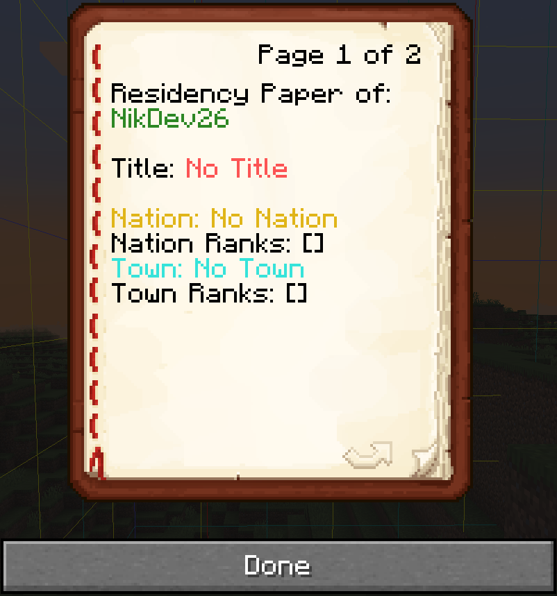
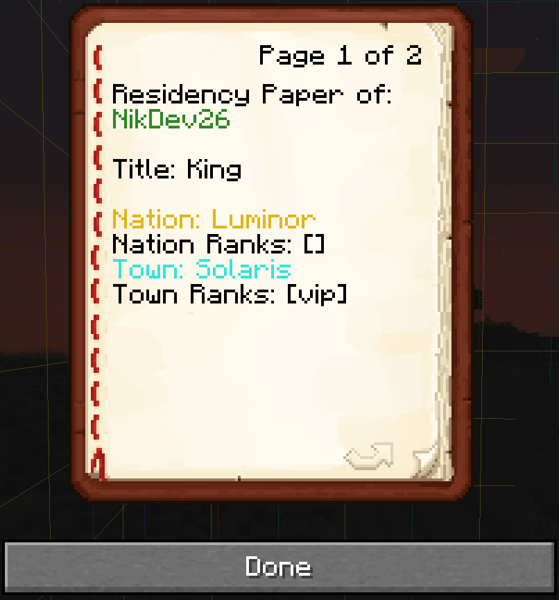
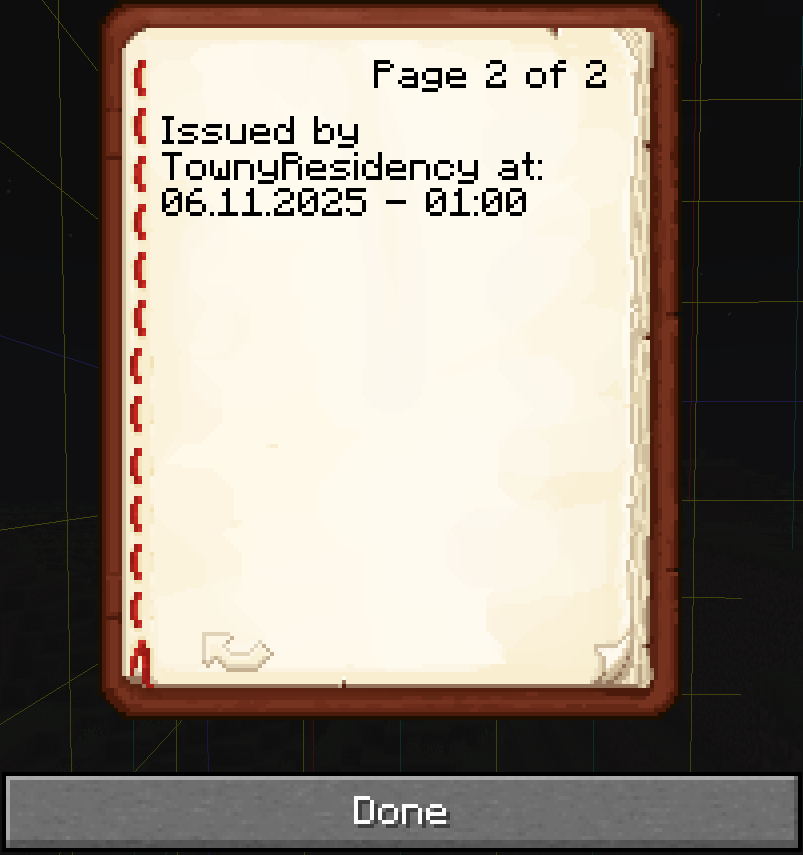

# Towny Residency
Towny Residency is a plugin that adds a "Residency Paper" a form of ID Card, intended to use alongside Towny (hard dependency) for RP purposes.

## Commands:
**residency:**\
description: Gives out your own Residency Paper. \
usage: /residency

## Images:
<figure>
  
  <figcaption>Residency Paper when not being resident of a Town nor Nation, having no Title and no Ranks.</figcaption>
</figure>
  
<figure>
  
  <figcaption>Residency Paper with entries. Town, Nation, Title & Ranks.</figcaption>
</figure>
  
<figure>
  
  <figcaption>Residency Paper Date & Time timestamp when issued, on page 2 of the Residency Paper.</figcaption>
</figure>

